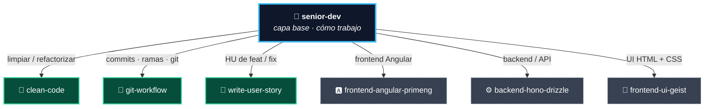

# 🛠️ eecheverria-skills

Skills personales de [**eecheverria**](mailto:eecheverria@paloblanco.com) para **Claude Code**,
compartidas entre varias computadoras.

Este repositorio se clona en `~/.claude/skills` de cada máquina y es la **fuente de verdad**. Al iniciar
una sesión de trabajo se baja lo último:

```bash
git -C ~/.claude/skills pull --ff-only
```

---

## 🧭 Cómo se organizan

`eecheverria-senior-dev` es la **skill principal (capa base)**: define *cómo* trabajo durante toda la
sesión y **delega el detalle** a las demás según la tarea. No repite lo que hacen las otras — las llama.



**Leyenda:** 🟦 skill principal · 🟩 en este repo · ⬜ (borde punteado) local, aún no versionada aquí.

Las capas se **combinan**: un mismo trabajo puede activar varias en cadena — p. ej. un refactor cierra
con `clean-code` (limpieza) + `git-workflow` (commits separados); un feature en Angular combina
`senior-dev` + `frontend-angular-primeng`.

---

## 📚 Skills

### 🧠 Capa base — el modo de operar

| Skill | Qué hace |
|---|---|
| **`eecheverria-senior-dev`** | Modo de operar como desarrollador senior toda la sesión: ritual de inicio (sincroniza skills, mapea proyectos, lee los `CLAUDE.md`), uso de subagentes para cuidar el contexto, comportamientos no negociables (declarar supuestos, push back, disciplina de alcance, verificar) y **delegación** al resto de skills. |

### 🧩 Capas transversales — calidad y disciplina (agnósticas de stack)

| Skill | Qué hace |
|---|---|
| **`eecheverria-clean-code`** | Principios de código limpio y simplificación: reducir complejidad sin cambiar el comportamiento, mejorar legibilidad y eliminar redundancia (Cerca de Chesterton, DRY con criterio). |
| **`eecheverria-git-workflow`** | Disciplina de git en el día a día: commits atómicos, *conventional commits*, ramas de vida corta (trunk-based), separar refactor de feature, worktrees e higiene pre-commit. |

### 📝 Utilidad

| Skill | Qué hace |
|---|---|
| **`eecheverria-write-user-story`** | Redacta historias de usuario (HU) del proyecto DPB con el formato "COMO Usuario QUIERO … PARA …", listas para copiar en Jira, con ponderación Scrum Poker. |

### 🎯 Stack — específicas por tecnología · _local, aún no en este repo_

| Skill | Qué hace |
|---|---|
| `eecheverria-frontend-angular-primeng` | Código frontend senior en Angular 21 (standalone, signals, zoneless) + PrimeNG 21. |
| `eecheverria-backend-hono-drizzle` | Código backend senior con Node + Hono + Drizzle (MySQL/PlanetScale) + Joi + JWT + Swagger. |
| `eecheverria-frontend-ui-geist` | UI/UX en HTML + CSS puro, estética minimalista tipo Vercel Geist / Linear. |

---

## 💻 Uso en una computadora nueva

```bash
git clone https://github.com/ErickEcheverria/eecheverria-skills.git ~/.claude/skills
```

Y en cada sesión, para mantenerte al día:

```bash
git -C ~/.claude/skills pull --ff-only
```
