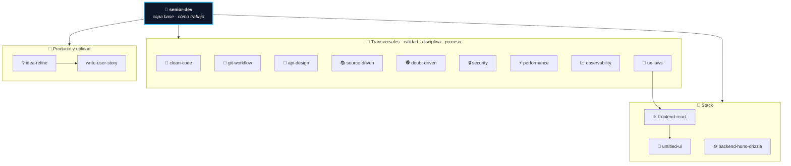

# 🛠️ eecheverria-skills

Skills de [**eecheverria**](mailto:eecheverria@paloblanco.com) para **Claude Code**, empaquetadas como
**plugin** y distribuidas por el marketplace `paloblanco`.

Este repositorio es la **fuente de verdad**. Se instala una vez por máquina y Claude Code lo mantiene al
día: ya no hace falta clonarlo en `~/.claude/skills` ni hacer `git pull` en cada sesión.

```bash
claude plugin marketplace add ErickEcheverria/eecheverria-skills
claude plugin install pb-skills@paloblanco
```

---

## 🧭 Cómo se organizan

`eecheverria-senior-dev` es la **skill principal (capa base)**: define *cómo* trabajo durante toda la
sesión y **delega el detalle** a las demás según la tarea. No repite lo que hacen las otras — las llama.
Varias pueden aplicar **en cadena** (p. ej. un feature React cierra con `clean-code` + `git-workflow`).



---

## 📚 Skills

### 🧠 Capa base — el modo de operar

| Skill | Qué hace |
|---|---|
| **`eecheverria-senior-dev`** | Modo de operar como desarrollador senior toda la sesión: ritual de inicio (sincroniza skills, mapea proyectos, lee los `CLAUDE.md`), subagentes para cuidar el contexto, comportamientos no negociables (declarar supuestos, push back, disciplina de alcance, verificar), rebanadas verticales y **delegación** al resto de skills. |

### 🧩 Transversales — calidad, disciplina y proceso (agnósticas de stack)

| Skill | Qué hace |
|---|---|
| **`eecheverria-clean-code`** | Código limpio y simplificación: reducir complejidad sin cambiar el comportamiento, mejorar legibilidad, eliminar redundancia (Cerca de Chesterton, DRY con criterio). |
| **`eecheverria-git-workflow`** | Disciplina de git diaria: commits atómicos, *conventional commits*, ramas de vida corta (trunk-based), separar refactor de feature, worktrees e higiene pre-commit. |
| **`eecheverria-api-design`** | Diseño de contratos e interfaces antes de implementar: Ley de Hyrum, versionado, semántica de errores, validar en fronteras, patrones REST y TypeScript. |
| **`eecheverria-source-driven`** | Fundamentar el código específico de un framework/versión en su documentación oficial (DETECT → FETCH → IMPLEMENT → CITE). Clave con stacks recientes. |
| **`eecheverria-doubt-driven`** | Revisión adversarial de contexto fresco para decisiones no triviales o de alto riesgo (CLAIM → EXTRACT → DOUBT → RECONCILE → STOP). |
| **`eecheverria-security`** | Seguridad security-first: threat modeling (STRIDE), OWASP Top 10, SSRF, validación en fronteras, secretos, rate limiting y seguridad de features con LLM. Adaptada a Hono/Joi/JWT. |
| **`eecheverria-performance`** | Optimización con disciplina de medición (MEASURE → IDENTIFY → FIX → VERIFY → GUARD): N+1, paginación, re-renders, bundle. Rechaza la optimización prematura. |
| **`eecheverria-observability`** | Instrumentar para producción: logging estructurado (pino + correlation IDs), métricas RED, tracing (OpenTelemetry), alertas sobre síntomas y health checks. Adaptada a Hono/Drizzle. |
| **`eecheverria-ux-laws`** | Criterio de UX al diseñar interfaces: convierte cada ley de [Laws of UX](https://lawsofux.com/es/) en una consecuencia concreta de la UI (Hick, Fitts, Jakob, Gestalt, Umbral de Doherty, Von Restorff, Tesler/Occam/Pareto). Incluye el catálogo de las 30 leyes y cómo resolver los conflictos entre ellas. |

### 🎯 Stack — específicas por tecnología

| Skill | Qué hace |
|---|---|
| **`eecheverria-frontend-react`** | UI de calidad de producción en React + Tailwind: arquitectura de componentes, estado, design system minimalista, accesibilidad WCAG y estados de carga/vacío/error. |
| **`eecheverria-untitled-ui`** | El design system **Untitled UI React** (React 19 + Tailwind v4 + React Aria): busca en el catálogo antes de escribir, trae con el CLI (`add`/`search`), estiliza solo con tokens semánticos y respeta la frontera free (MIT) vs PRO. Incluye el catálogo completo y los patrones de uso por componente. |
| **`eecheverria-backend-hono-drizzle`** | Backend senior con Node + Hono + Drizzle (MySQL/PlanetScale) + Joi + JWT + Swagger, arquitectura modular. |

### 📝 Producto y utilidad

| Skill | Qué hace |
|---|---|
| **`eecheverria-idea-refine`** | Afina una idea cruda o a medio cocinar antes de escribir HU o código: la reformula, saca supuestos, define alcance y el "qué NO hacer". Ajusta su profundidad a la madurez de la idea. Entrega a `write-user-story`. |
| **`eecheverria-write-user-story`** | Historias de usuario (HU) del proyecto DPB con el formato "COMO Usuario QUIERO … PARA …", listas para Jira, con ponderación Scrum Poker. |

---

## 💻 Uso en una computadora nueva

```bash
claude plugin marketplace add ErickEcheverria/eecheverria-skills
claude plugin install pb-skills@paloblanco
```

Lo mismo desde una sesión de Claude Code: `/plugin marketplace add …` y `/plugin install …`.

Para traer la última versión:

```bash
claude plugin marketplace update paloblanco
```

Ventaja sobre clonar directo en `~/.claude/skills`: ese directorio queda libre para las skills
personales de cada quien, y las de este repo llegan namespaceadas bajo el plugin, sin chocar.

---

## 🏢 Uso por repositorio (equipo)

Para que un repositorio entregue estas skills automáticamente a quien lo clone, se commitea
`.claude/settings.json` (versionado — **no** `settings.local.json`):

```json
{
  "extraKnownMarketplaces": {
    "paloblanco": {
      "source": { "source": "github", "repo": "ErickEcheverria/eecheverria-skills" }
    }
  },
  "enabledPlugins": { "pb-skills@paloblanco": true }
}
```

Quien clone ese repo abre Claude Code y ya tiene las skills, sin instalar nada a mano.

---

## 🧱 Estructura del repo

```
.claude-plugin/
├── marketplace.json   catálogo (marketplace `paloblanco`)
└── plugin.json        manifiesto del plugin `pb-skills`
skills/
└── eecheverria-*/     una carpeta por skill, con su SKILL.md
```

Claude Code descubre las skills en `<raíz-del-plugin>/skills/`, por eso viven ahí.

Para **agregar** una skill: carpeta nueva bajo `skills/` con su `SKILL.md`, y push. Para **quitarla**:
se borra.

> ⚠️ **Sube `version` en los DOS manifiestos en cada cambio** — `.claude-plugin/plugin.json` y la entrada
> del plugin en `.claude-plugin/marketplace.json`. No es cosmético: si la versión no cambia, quien ya
> tiene el plugin instalado **no recibe la actualización** aunque corra `claude plugin marketplace
> update paloblanco`. El catálogo se refresca, pero su copia local del plugin se queda como estaba y la
> única salida es desinstalar y reinstalar. Ya pasó al mergear los PRs #2 y #3.

Un mismo marketplace admite varios plugins, así que más adelante esto se puede partir
(`pb-core` / `pb-frontend` / `pb-backend`) sin que nadie cambie su comando de instalación.
